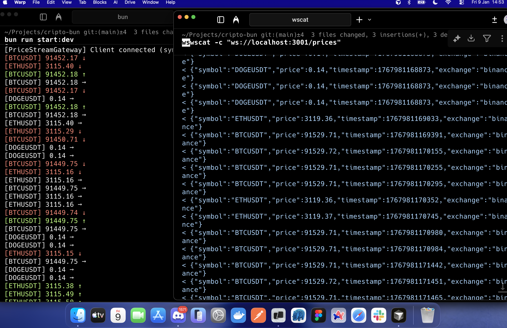

# PulseCoin

**Real-time cryptocurrency market data engine built with Bun and NestJS**

`#bun #nestjs #event-driven #crypto #websocket #real-time #typescript`



---

## Overview

PulseCoin is a **real-time, event-driven market data engine** focused on ingesting live cryptocurrency prices from Binance and distributing them as streams to multiple consumers.

This project is intentionally **backend-only**. There is no frontend. The system is observed through:

- Terminal output with color-coded price changes
- WebSocket streams for external clients
- Structured logging

PulseCoin is designed to be:

- **Event-driven at its core** - All communication happens through domain events
- **Strongly aligned with SOLID principles** - Clean architecture and separation of concerns
- **Modular, decoupled and scalable** - Each module is independent and testable
- **Test-first friendly** - Comprehensive test coverage across all layers
- **Free from premature infrastructure** - No databases, queues, or unnecessary dependencies

---

## Architecture

PulseCoin follows a clean event-driven architecture with complete decoupling between modules:

```
Binance WebSocket
       ↓
Market Ingestion Layer → PriceTickReceived
       ↓
Event Bus (RxJS Subject)
       ↓
Price Processing Layer → PriceTickProcessed
       ↓
Streaming Layer
       ├── Terminal Output
       └── WebSocket Gateway
```
## Getting Started

### Prerequisites

- [Bun](https://bun.sh/) v1.0 or higher

### Installation

```bash
git clone https://github.com/iamdevmarcos/pulse-coin
cd cripto-bun

# Install dependencies
bun install
```

### Running the Engine

```bash
# Development mode (with hot reload)
bun run start:dev

# Production mode
bun run start:prod
```

## Monitored Symbols

By default, PulseCoin monitors the following cryptocurrency pairs:

- **BTCUSDT** - Bitcoin / US Dollar
- **ETHUSDT** - Ethereum / US Dollar  
- **SOLUSDT** - Solana / US Dollar
- **BNBUSDT** - Binance Coin / US Dollar

To modify the symbols, edit `src/market/ingestion/services/market-ingestion.service.ts`:

```typescript
private readonly symbols = ['BTCUSDT', 'ETHUSDT', 'SOLUSDT', 'BNBUSDT'];
```

---